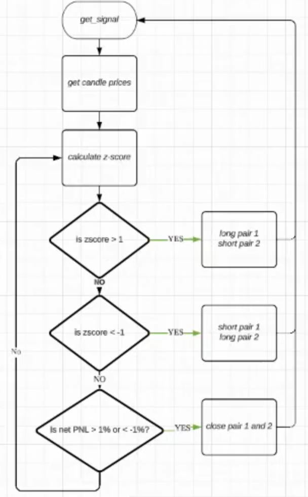

# [Statistical Arbitrage](./statarb.py)
Statistical arbitrage trading strategy, which utilizes statistics as indicators to identify cointegrated pairs and generate signals for trading the spreads between them. The strategy is implemented based on the DirectionalStrategyBase framework.
- **Environment**: Suitable for any market condition, requiring two trading pairs that are cointegrated with prices moving closely in the same direction over the long term but experiencing some price deviation in the short term.
- **Description**:
  - Analyze two trading pairs' cointegration at certain periods.
  - Calculate spread and z-score.
  - Identify highest and lowest z-score values.
  - Select positive and negative z-score values with high frequency crossings.
  - Enter and exit both long and short positions simultaneously at desired z-score levels.
- **Inputs** required:
  - Trading pair 1
  - Trading pair 2
  - Exchange
  - Order amount
  - Leverage
  - Z-score entry value
  - Take profit percentage
  - get candles of 2 trading pairs
This strategy aims to capitalize on temporary deviations from equilibrium in cointegrated pairs by executing trades based on calculated z-scores.
## Status Command
- price or 2 trading pairs
- z-score
- executed positions .net P&L
## Events and Responses
STRATEGY (backtest)
- get candles data of 2 trading pairs 
- find correlated trading pairs 
- calculate cointegration
- p-value < 0.05
- T-value < C-value
- analyze spread/z-score
- find correlated pairs
https://www.macroaxis.com/invest/crypto-correlation/Binance/All-Coins
https://hyblockcapital.com/correlationplot
- backtest z-score
https://www.tradingview.com/script/1GBXATMZ-2-Symbols-Z-Score/
SIGNAL
- calculate hedge ratio, spread and z-score
- get current z-score
EXECUTION (zscore and net PNL values are only for example, can change accordingly)
- if z-score > 1. long trading pair 1, short trading pair 2
- if z-score < -1. close both position (stop loss)
if net PnL > 1% take profit
- if net PnL < -1%, stop loss
## Strategic Logic
